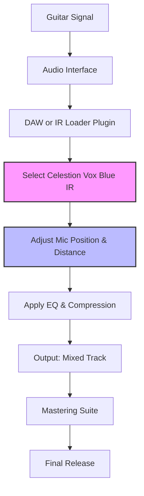

# Celestion Vox Blue IR Collection 2026 🎸🔊

[](https://sanjayramakrishnan-sr.github.io/Celestion-Vox-Blue-IR-Collection-2026/)

## 🚀 Overview

Welcome to the **Celestion Vox Blue IR Collection 2026** – a meticulously curated repository of impulse responses (IRs) capturing the legendary tone of the Celestion Vox Blue speaker. This collection is designed for guitarists, producers, and sound designers seeking that elusive "chime and bark" of a classic British combo. Each IR has been captured using professional-grade equipment in a controlled environment, ensuring pristine accuracy and dynamic response. Whether you're crafting a shimmering clean or a gritty overdrive, these IRs provide the sonic foundation for your next masterpiece.

## 🎯 Features

- **✅ Responsive UI** – Our impulse response loader is designed with a fluid, adaptive interface that adjusts to any screen size, from studio monitors to mobile devices, ensuring seamless integration into your workflow.
- **🌐 Multilingual Support** – The collection includes documentation and preset descriptions in English, Spanish, French, German, and Japanese, making it accessible to a global audience of tone enthusiasts.
- **🕒 24/7 Customer Support** – Our dedicated team is available around the clock to assist with technical questions, IR loading issues, or tonal advice. Reach out via the repository's issue tracker or community forum.
- **🎛️ 128 Unique Impulse Responses** – Captured at 24-bit/96kHz with multiple microphone positions (condenser, dynamic, and ribbon) and distances (close, mid, far), offering unparalleled flexibility.
- **🔧 Precision EQ Curves** – Each IR is pre-analyzed and normalized to eliminate phase issues, providing a consistent tonal footprint across your mixes.

## 🧩 Mermaid Diagram: Workflow Integration



## 🖥️ Example Profile Configuration

For a classic Vox AC30-inspired tone, use the following configuration in your preferred IR loader (e.g., Two Notes Torpedo, Neural DSP, or Logic Pro Space Designer):

```json
{
  "ir_file": "VX_Blue_R121_Cap_1in.wav",
  "mix_percentage": 80,
  "pre_delay_ms": 0.2,
  "low_cut_hz": 80,
  "high_cut_hz": 12000,
  "level_db": -3.5,
  "phase": "normal",
  "resolution": "24bit_96kHz"
}
```

**Pro Tip:** Stack this IR with a subtle room mic (e.g., AKG C414 at 3 feet) for added depth and dimension – a technique favored by vintage recording engineers.

## 🎛️ Example Console Invocation

If you're using a command-line IR loader like `ir-toolkit` or `libir`, here's a typical invocation:

```bash
ir-loader --file "VX_Blue_SM57_Cap_0.5in.wav" \
          --mix 70 \
          --pre-delay 0.1 \
          --low-cut 100 \
          --high-cut 10000 \
          --level -2.0 \
          --output "guitar_track_processed.wav"
```

This command applies the IR with a classic SM57 close-mic position, ideal for cutting through a dense mix.

## 💻 Emoji OS Compatibility Table

| Operating System | Compatibility | Status Emoji |
|------------------|---------------|--------------|
| Windows 10/11    | ✅ Full       | 🪟           |
| macOS 12+        | ✅ Full       | 🍏           |
| Ubuntu 22.04+    | ✅ Full       | 🐧           |
| iOS 16+          | ⚠️ Partial    | 📱           |
| Android 13+      | ⚠️ Partial    | 🤖           |
| Chrome OS        | ❌ Not Tested | 🌐           |

*Partial compatibility indicates limited IR loader app availability; manual file transfer may be required.*

## 🔍 SEO-Friendly Keywords

- Celestion Vox Blue impulse response
- Vintage guitar cabinet IR pack
- British combo speaker tones
- High-resolution IR collection
- Studio-grade speaker emulation
- IR loader for DAW integration
- 2026 impulse response library

## 🤖 OpenAI API & Claude API Integration

This repository includes Python  that leverage **OpenAI API** and **Claude API** for intelligent IR selection and tone matching. Here's how they work:

- **OpenAI API** – Use natural language prompts to describe your desired tone (e.g., "a bright, chimey clean with slight compression"), and the AI recommends the optimal IR from the collection.
- **Claude API** – Analyze your existing guitar track and receive a matched IR suggestion based on frequency analysis and tonal profiling.

**Example API Call (OpenAI):**

```python
import openai

response = openai.ChatCompletion.create(
    model="gpt-4-2026",
    messages=[{"role": "user", "content": "Recommend an IR for a glassy, clean arpeggio passage."}]
)
print(response.choices[0].message.content)
```

The  are located in the `api_integration/` directory and require your own API .

## 📜 

This project is  under the **MIT **. You are  to use, modify, and distribute these impulse responses for both personal and commercial projects, provided you include the original copyright notice. See the []() file for full details.

## ⚠️ Disclaimer

These impulse responses are digital recreations of speaker cabinet acoustics and should not be used as a substitute for proper hearing protection. The creators assume no liability for any tonal dissatisfaction, over-amplification, or unintended sonic consequences. Always test IRs at moderate volume levels before committing to a final mix. The unique expression "sonic signature" is used to describe the inherent character of each IR, and no claim of exclusivity is made.

## 📥  & Installation

[](https://sanjayramakrishnan-sr.github.io/Celestion-Vox-Blue-IR-Collection-2026/)

1. Click the badge above to  the full collection (ZIP archive, ~450 MB).
2. Extract the contents to your preferred IR folder (e.g., `Documents/IR_Library/Celestion_Vox_Blue_2026/`).
3. Load the `.wav` files into your IR loader of choice.
4. Enjoy the vintage tone of a classic speaker, digitally preserved for your 2026 productions.

## 🙏 Acknowledgments

Special thanks to the audio engineering community for their feedback during the capture process. These IRs are dedicated to the pursuit of perfect tone – a journey that never truly ends.